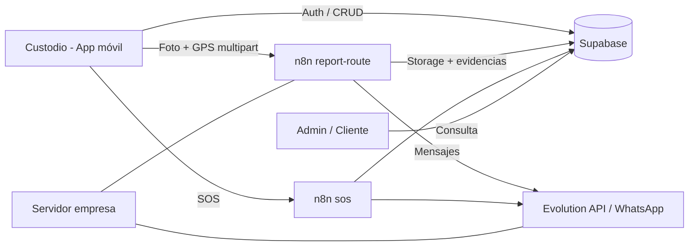

# Servicons Mobile — Planeación del proyecto y análisis de costos

**Equipo:** Luis Eduardo Pérez · Leonardo Delgado · Cristopher Jaciel  
**Empresa:** Servicons (custodia y monitoreo de unidades)  
**Fecha de referencia:** Junio 2026  
**Tipo de despliegue backend acordado:** Servidores físicos de la empresa (equipos reutilizados)

---

## 1. Resumen del proyecto

**Servicons Mobile** es una aplicación móvil (React Native + Expo) para custodios en campo. Permite:

| Módulo              | Qué hace                                                            |
| ------------------- | ------------------------------------------------------------------- |
| **Auth**            | Login, registro por rol, recuperación de contraseña (Supabase Auth) |
| **Bitácora**        | Wizard de 7 pasos con datos legales del servicio                    |
| **Custodia activa** | GPS + fotos periódicas + botón SOS                                  |
| **Cierre**          | Foto final, firmas digitales, PDF local                             |
| **Admin**           | Panel para super usuario / jefe de custodios                        |
| **Cliente**         | Consulta de bitácoras de su empresa                                 |

**Stack confirmado en código:**

- **App:** React Native, Expo 54, TypeScript, NativeWind, expo-router, Zustand  
- **Backend datos:** Supabase (PostgreSQL + Auth + Storage + Edge Functions)  
- **Automatización:** n8n (`report-route`, `sos`, `get-channels`)  
- **WhatsApp:** Evolution API (integrado en n8n)  
- **PDF:** Generación local en dispositivo (`reportPdfService`)

---

## 2. Roles del equipo (propuesta)

| Persona                | Rol principal             | Responsabilidades                                                                                           |
| ---------------------- | ------------------------- | ----------------------------------------------------------------------------------------------------------- |
| **Luis Eduardo Pérez** | Líder técnico / app móvil | Arquitectura, wizard, custodia activa, cola offline, integración n8n, builds APK                            |
| **Leonardo Delgado**   | Backend e infraestructura | Supabase (SQL, RLS, Edge Functions), n8n workflows, Evolution API, servidores en empresa                    |
| **Cristopher Jaciel**  | QA, UX y documentación    | Pruebas en dispositivo real, validación de flujos legales, guiones de capacitación, checklist de despliegue |

> Los roles son flexibles; lo importante es que cada fase tenga un responsable único y un revisor del equipo.

---

## 3. Planeación paso a paso

### Fase 0 — Arranque y acuerdos (Semana 1)

| #   | Actividad                                                                           | Responsable  | Entregable                       |
| --- | ----------------------------------------------------------------------------------- | ------------ | -------------------------------- |
| 0.1 | Leer `PROYECTO_SERVI_MASTER_V2.txt` y alinear alcance                               | Todos        | Acta corta de alcance            |
| 0.2 | Crear repo, `.env`, cuentas Supabase y Expo                                         | Luis Eduardo | Repo funcional + `.env.example`  |
| 0.3 | Definir roles de usuario (`super_usuario`, `jefe_custodios`, `custodio`, `cliente`) | Leonardo     | Tabla `profiles` + RLS           |
| 0.4 | Elegir dispositivos de prueba (Android físico)                                      | Cristopher   | Lista de 2–3 teléfonos de prueba |

**Criterio de salida:** cualquier integrante puede hacer login en Expo Go.

---

### Fase 1 — Base de datos y autenticación (Semanas 2–3)

| #   | Actividad                                                         | Responsable  | Entregable                 |
| --- | ----------------------------------------------------------------- | ------------ | -------------------------- |
| 1.1 | Ejecutar SQL: `profiles`, `bitacoras`, `evidencias`, `sos_alerts` | Leonardo     | Esquema en Supabase        |
| 1.2 | Políticas RLS (`custodio_id = auth.uid()`)                        | Leonardo     | Políticas verificadas      |
| 1.3 | Pantallas login, registro, reset password                         | Luis Eduardo | Flujo auth completo        |
| 1.4 | Edge Functions `create-user` / `update-user`                      | Leonardo     | Admin puede crear usuarios |
| 1.5 | Pruebas de roles y redirección por rol                            | Cristopher   | Checklist auth ✓           |

**Criterio de salida:** custodio solo ve sus bitácoras; admin ve panel completo.

---

### Fase 2 — Wizard de bitácora (Semanas 4–6)

| #   | Actividad                                       | Responsable  | Entregable                      |
| --- | ----------------------------------------------- | ------------ | ------------------------------- |
| 2.1 | Steps 1–7 del wizard + store Zustand            | Luis Eduardo | INSERT en Supabase al finalizar |
| 2.2 | Firmas Base64, validación de tiempos            | Luis Eduardo | `validateBitacoraTiempos`       |
| 2.3 | Selector de contactos WhatsApp (`get-channels`) | Leonardo     | `ChannelPicker` conectado       |
| 2.4 | Ubicaciones favoritas y sugerencias             | Luis Eduardo | Hooks de favoritos              |
| 2.5 | Prueba legal: folio, operadores, responsables   | Cristopher   | Bitácora de prueba válida       |

**Criterio de salida:** bitácora en estado `borrador` lista para iniciar custodia.

---

### Fase 3 — Custodia activa y n8n (Semanas 7–9)

| #   | Actividad                                      | Responsable  | Entregable                   |
| --- | ---------------------------------------------- | ------------ | ---------------------------- |
| 3.1 | Importar workflow `report-route-workflow.json` | Leonardo     | Webhook operativo            |
| 3.2 | Pantalla `custody/active`: timer, cámara, GPS  | Luis Eduardo | Reportes cada N minutos      |
| 3.3 | Cola offline (`reportQueueService`)            | Luis Eduardo | Reintentos sin perder fotos  |
| 3.4 | Workflow SOS + alertas admin                   | Leonardo     | `sos_alerts` + WhatsApp      |
| 3.5 | Prueba de 2 h en campo simulado                | Cristopher   | Log de evidencias + WhatsApp |

**Criterio de salida:** inicio → reportes → término activan n8n y guardan en Storage.

---

### Fase 4 — Cierre, PDF y panel admin (Semanas 10–12)

| #   | Actividad                                      | Responsable             | Entregable                   |
| --- | ---------------------------------------------- | ----------------------- | ---------------------------- |
| 4.1 | Pantalla `finish.tsx` (foto final + firmas)    | Luis Eduardo            | Cierre con `estatus=termino` |
| 4.2 | Export PDF local                               | Luis Eduardo            | PDF compartible              |
| 4.3 | Panel admin: activos, bitácoras, SOS, usuarios | Luis Eduardo + Leonardo | Módulo admin usable          |
| 4.4 | Vista cliente (solo lectura)                   | Luis Eduardo            | Rol `cliente` funcional      |
| 4.5 | Prueba integral extremo a extremo              | Cristopher              | Informe de bugs priorizados  |

**Criterio de salida:** servicio completo de punta a punta sin Expo Go (APK interno).

---

### Fase 5 — Pulido y entrega piloto (Semanas 13–14)

| #   | Actividad                                      | Responsable  | Entregable                |
| --- | ---------------------------------------------- | ------------ | ------------------------- |
| 5.1 | Permisos Android (cámara, GPS, notificaciones) | Luis Eduardo | `permissions.tsx` estable |
| 5.2 | Build APK (`eas build` o local)                | Luis Eduardo | APK firmado para prueba   |
| 5.3 | Manual corto para custodios (1 página)         | Cristopher   | PDF / WhatsApp interno    |
| 5.4 | Capacitación piloto con 3–5 custodios          | Todos        | Feedback documentado      |
| 5.5 | Corrección de bugs críticos                    | Luis Eduardo | Versión piloto estable    |

**Criterio de salida:** piloto en operación real con supervisión admin.

---

### Fase 6 — Escalamiento empresarial (Mes 4 en adelante)

| #   | Actividad                                       | Responsable          | Entregable                    |
| --- | ----------------------------------------------- | -------------------- | ----------------------------- |
| 6.1 | Migrar n8n + Evolution API a servidor empresa   | Leonardo             | Docker Compose en PC dedicada |
| 6.2 | Supabase Pro + política de retención de fotos   | Leonardo             | Backups diarios               |
| 6.3 | Distribución masiva APK (MDM o carpeta interna) | Luis Eduardo         | 100 dispositivos instalados   |
| 6.4 | Monitoreo uptime (n8n, Supabase, internet)      | Leonardo             | Alerta si cae el servidor     |
| 6.5 | Capacitación masiva + soporte L1                | Cristopher           | Mesa de ayuda interna         |
| 6.6 | Evaluar WhatsApp oficial vs Evolution           | Leonardo + dirección | Decisión de cumplimiento      |

**Criterio de salida:** operación estable para ~100 trabajadores.

---

## 4. Diagrama de flujo operativo

---

## 5. Costos actuales (fase desarrollo / piloto)

Escenario: proyecto en curso, pruebas con Expo Go y pocos usuarios reales.

### 5.1 Servicios en la nube

| Concepto          | Plan actual estimado                                     | Costo mensual (USD) | Costo mensual (MXN)* |
| ----------------- | -------------------------------------------------------- | ------------------- | -------------------- |
| **Supabase**      | Free (hobby)                                             | $0                  | $0                   |
| **Expo / EAS**    | Free (15 builds Android/mes)                             | $0                  | $0                   |
| **n8n**           | Cloud compartido (`n8n.pymemind.com`) o servidor empresa | $0 – $26            | $0 – $450            |
| **Evolution API** | Mismo servidor que n8n                                   | $0                  | $0                   |
| **Dominio + SSL** | Opcional en piloto                                       | $0 – $5             | $0 – $85             |
| **Google Play**   | Solo si publican en tienda (único)                       | —                   | ~$425 (una vez)      |

 Tipo de cambio de referencia: **$17 MXN / USD** (Jun 2026).

### 5.2 Hardware y operación (piloto)

| Concepto                                 | Costo                                   |
| ---------------------------------------- | --------------------------------------- |
| PCs de desarrollo (ya existentes)        | $0 adicional                            |
| 2–5 celulares Android de prueba          | $0 si son personales / empresa          |
| Internet oficina                         | Ya cubierto por la empresa              |
| Electricidad servidor piloto (1 PC 24/7) | ~~$15 – $40 USD/mes (~~$255 – $680 MXN) |

### 5.3 Total actual estimado

| Escenario                                       | USD/mes       | MXN/mes           |
| ----------------------------------------------- | ------------- | ----------------- |
| **Mínimo** (todo free + servidor en PC empresa) | **$15 – $40** | **$255 – $680**   |
| **Con n8n Cloud Starter**                       | **$40 – $65** | **$680 – $1,100** |

> En la práctica, la fase actual casi no genera costos de licencias; el gasto real es tiempo del equipo y electricidad del servidor.

---

## 6. Costos empresariales — 100 trabajadores

### 6.1 Supuestos de operación

Para dimensionar costos usamos un escenario **ocupado pero realista**:

| Variable                                  | Valor                               |
| ----------------------------------------- | ----------------------------------- |
| Total empleados                           | 100                                 |
| Custodios en campo                        | ~70                                 |
| Admin / jefes / clientes                  | ~30                                 |
| Custodios con servicio activo un día pico | 40                                  |
| Servicios por custodio activo / día       | 2                                   |
| Duración promedio del servicio            | 6 horas                             |
| Intervalo de reporte                      | 15 min (default)                    |
| Fotos por servicio                        | ~26 (24 reportes + inicio + cierre) |
| Tamaño promedio por foto                  | ~1 MB                               |
| Contactos WhatsApp por servicio           | 2                                   |

**Volumen diario estimado (día pico):**

- Servicios activos: 40 × 2 = **80 servicios/día**
- Fotos: 80 × 26 = **~2,080 fotos/día**
- Almacenamiento nuevo: **~2 GB/día → ~60 GB/mes**
- Ejecuciones n8n (`report-route`): **~2,080/día → ~62,000/mes**
- Mensajes WhatsApp: 2,080 × 2 contactos = **~4,160/día → ~125,000/mes**

---

### 6.2 Infraestructura en servidores de la empresa

Backend acordado: **PCs/servidor propio** para n8n + Evolution API (+ opcionalmente proxy inverso).

| Componente                   | Especificación mínima recomendada | Inversión inicial (USD) | Inversión inicial (MXN) |
| ---------------------------- | --------------------------------- | ----------------------- | ----------------------- |
| Servidor principal           | 4 vCPU, 8 GB RAM, 500 GB SSD      | $0* – $1,200            | $0 – $20,400            |
| Servidor respaldo (opcional) | 2 vCPU, 4 GB RAM                  | $0* – $600              | $0 – $10,200            |
| UPS                          | 900 VA                            | $80 – $150              | $1,360 – $2,550         |
| Switch / router dedicado     | Gigabit                           | $50 – $200              | $850 – $3,400           |
| Fibra o internet redundante  | Segundo enlace (opcional)         | $0 – $500 instalación   | $0 – $8,500             |

 **$0** si reutilizan computadoras que la empresa ya tiene y no usa.

**Software (servidor propio):**

| Software                    | Licencia mensual |
| --------------------------- | ---------------- |
| n8n Community (self-hosted) | **$0**           |
| Evolution API (open source) | **$0**           |
| Docker + PostgreSQL + Redis | **$0**           |
| Nginx / Caddy (SSL)         | **$0**           |

**Costo mensual de operar servidores propios:**

| Concepto                             | USD/mes         | MXN/mes             |
| ------------------------------------ | --------------- | ------------------- |
| Electricidad (1–2 equipos 24/7)      | $30 – $80       | $510 – $1,360       |
| Internet dedicado / upgrade          | $50 – $150      | $850 – $2,550       |
| Mantenimiento IT interno (~8 h/mes)† | $80 – $200‡     | $1,360 – $3,400     |
| **Subtotal infra propia**            | **$160 – $430** | **$2,720 – $7,310** |

† Horas internas; no es pago externo si lo hace el equipo.  
‡ Equivalente a ~$10–25 USD/hora de valor interno.

---

### 6.3 Supabase (nube — recomendado mantener)

Aunque el backend de automatización esté en empresa, **Supabase sigue siendo el núcleo de datos** (Auth, PostgreSQL, Storage, Realtime).

| Concepto                                                      | Plan                                           | USD/mes       | MXN/mes           |
| ------------------------------------------------------------- | ---------------------------------------------- | ------------- | ----------------- |
| Supabase Pro (base)                                           | Incluye 100K MAU, 100 GB storage, 8 GB DB      | $25           | $425              |
| Storage extra (~60 GB/mes nuevos; retención 12 meses ~720 GB) | Política de archivo a frío o borrado a 90 días | $0 – $50      | $0 – $850         |
| Compute upgrade (si hay picos)                                | Micro → Small                                  | $0 – $15      | $0 – $255         |
| Edge Functions                                                | Dentro de cuota Pro                            | $0            | $0                |
| **Subtotal Supabase**                                         |                                                | **$25 – $90** | **$425 – $1,530** |

> Con **100 usuarios activos** no se paga extra por MAU. El costo crece por **fotos acumuladas** si no hay política de retención.

---

### 6.4 App móvil — builds y distribución

| Concepto               | Opción A (económica)               | Opción B (cloud builds)   |
| ---------------------- | ---------------------------------- | ------------------------- |
| Builds Android         | `eas build --local` o Gradle local | EAS Production ($199/mes) |
| Distribución           | APK interno / MDM empresa          | Misma + pipeline CI       |
| Google Play (opcional) | $25 único                          | $25 único                 |
| **Costo mensual**      | **$0**                             | **$199 (~$3,383 MXN)**    |

**Dispositivos para 70 custodios:**

| Escenario                                      | USD                  | MXN         |
| ---------------------------------------------- | -------------------- | ----------- |
| BYOD (celular del trabajador)                  | $0                   | $0          |
| Compra corporativa (70 × ~$180 USD gama media) | ~$12,600             | ~$214,200   |
| Renovación cada 3 años                         | ~$350/mes amortizado | ~$5,950/mes |

---

### 6.5 WhatsApp — el mayor variable de costo

Hoy el proyecto usa **Evolution API** (no oficial, sin costo por mensaje).

| Modelo                                                         | Costo mensual estimado (125K msgs) | Ventajas                             | Riesgos                                                       |
| -------------------------------------------------------------- | ---------------------------------- | ------------------------------------ | ------------------------------------------------------------- |
| **Evolution API (actual)**                                     | **$0** (solo servidor)             | Barato, flexible, ya integrado       | Bloqueo de número por Meta, sin tick verde, no enterprise SLA |
| **WhatsApp Cloud API oficial** (utilidad, México ~$0.0085/msg) | **~$1,060 USD/mes** (~$18,000 MXN) | Cumplimiento, estabilidad, escalable | Costo alto, templates, verificación Meta                      |
| **Híbrido** (Evolution piloto + oficial SOS/cierre)            | ~$200 – $400                       | Balance costo/confiabilidad          | Dos integraciones                                             |

**Recomendación empresarial:** mantener Evolution en piloto; para 100 trabajadores en producción crítica, presupuestar migración a API oficial o al menos número dedicado + respaldo.

---

### 6.6 Conectividad móvil en campo

Si la empresa paga datos móviles a 70 custodios:

| Concepto                             | USD/mes    | MXN/mes     |
| ------------------------------------ | ---------- | ----------- |
| Plan corporativo ~$25 USD/línea × 70 | **$1,750** | **$29,750** |
| Plan mixto (solo 40 líneas activas)  | **$1,000** | **$17,000** |

> Sin datos móviles estables, la cola offline ayuda pero los reportes y SOS se retrasan.

---

## 7. Resumen de costos — comparativa

### 7.1 Mensual recurrente

| Concepto                           | Actual (piloto)   | Empresa 100 trab. (conservador) | Empresa 100 trab. (completo) |
| ---------------------------------- | ----------------- | ------------------------------- | ---------------------------- |
| Supabase                           | $0                | $25 – $90                       | $25 – $90                    |
| Servidor empresa (n8n + Evolution) | $15 – $40         | $160 – $430                     | $160 – $430                  |
| Expo EAS                           | $0                | $0                              | $199                         |
| WhatsApp                           | $0                | $0 (Evolution)                  | ~$1,060 (API oficial)        |
| Datos móviles custodios            | $0                | $0 (BYOD)                       | $1,000 – $1,750              |
| Mantenimiento / soporte            | $0                | Incluido en equipo              | Incluido o contratar         |
| **TOTAL USD/mes**                  | **$15 – $65**     | **$185 – $520**                 | **$2,450 – $3,530**          |
| **TOTAL MXN/mes**                  | **$255 – $1,100** | **$3,145 – $8,840**             | **$41,650 – $60,010**        |

### 7.2 Inversión inicial (una sola vez)

| Concepto                                | USD                | MXN                   |
| --------------------------------------- | ------------------ | --------------------- |
| Servidor / UPS / red (si compran nuevo) | $200 – $2,000      | $3,400 – $34,000      |
| 70 celulares (si la empresa los compra) | $0 – $12,600       | $0 – $214,200         |
| Google Play Developer                   | $25                | $425                  |
| Capacitación inicial (material + horas) | Interno            | Interno               |
| **Rango total inicial**                 | **$225 – $14,625** | **$3,825 – $248,625** |

---

## 8. Escenario recomendado para Servicons

Dado que **el backend vivirá en servidores de la empresa**, la ruta más sensata es:

### Etapa 1 — Ahora (piloto, 3–10 usuarios)

- Supabase **Free** → **$0**
- n8n + Evolution en **PC empresa** → ~$30 USD/mes electricidad
- Builds **locales** → $0
- **Total: ~$500 – $1,000 MXN/mes**

### Etapa 2 — Producción inicial (20–40 custodios)

- Supabase **Pro** → ~$425 MXN/mes
- Servidor dedicado en empresa (reutilizado o comprado)
- APK interno + capacitación
- Política de retención de fotos (90 días en caliente)
- **Total: ~$3,500 – $6,000 MXN/mes** (sin comprar celulares ni pagar datos)

### Etapa 3 — Escala 100 trabajadores

- Supabase Pro + storage/archivo
- 2 servidores (principal + respaldo)
- Decisión WhatsApp: Evolution ($0) vs oficial (~$18,000 MXN/mes)
- Datos móviles según política BYOD o corporativa
- **Total conservador: ~$4,000 – $9,000 MXN/mes**
- **Total con datos + WhatsApp oficial: ~$45,000 – $60,000 MXN/mes**

---

## 9. Riesgos de costo y mitigación

| Riesgo                           | Impacto                     | Mitigación                                        |
| -------------------------------- | --------------------------- | ------------------------------------------------- |
| Acumulación de fotos en Supabase | +$500–$2,000 MXN/mes al año | Borrar/archivar evidencias > 90 días; bucket frío |
| Caída del servidor empresa       | Operación detenida          | UPS, segundo PC, alertas Telegram                 |
| Bloqueo WhatsApp Evolution       | Sin notificaciones          | Número de respaldo; migrar a API oficial          |
| Sin datos móviles                | Reportes tardíos            | Cola offline (ya implementada) + SIM corporativa  |
| Spend cap Supabase               | App deja de escribir        | Plan Pro + monitoreo de cuotas                    |

---

## 10. Checklist de despliegue empresarial

- [x] PC servidor con Docker (n8n + Evolution + PostgreSQL + Redis)
- [x] IP fija o dominio con SSL (`n8n.servicons.local` o público)
- [x] Supabase Pro activado + backups verificados
- [x] Política de retención de evidencias documentada
- [x] APK firmado distribuido a 100 dispositivos
- [ ] 3 roles admin capacitados (super_usuario, jefe_custodios)
- [ ] Manual de custodio de 1 página
- [ ] Prueba de carga: 10 custodios simultáneos 4 horas
- [ ] Plan B si cae internet (cola offline + número SOS alterno)

---

## 11. Fuentes de precios (Jun 2026)

- [Supabase Pricing](https://supabase.com/pricing) — Pro desde $25/mes  
- [Expo EAS Pricing](https://expo.dev/pricing) — Free / Starter $19 / Production $199  
- [n8n Pricing](https://n8n.io/pricing/) — Community self-hosted $0; Cloud desde €24/mes  
- [WhatsApp Business Platform Pricing](https://developers.facebook.com/documentation/business-messaging/whatsapp/pricing) — México utilidad ~$0.0085 USD/mensaje

---

*Documento generado para planeación interna del equipo Servicons. Cifras en MXN son estimaciones; validar tipo de cambio y cotizaciones locales antes de presupuesto formal.*